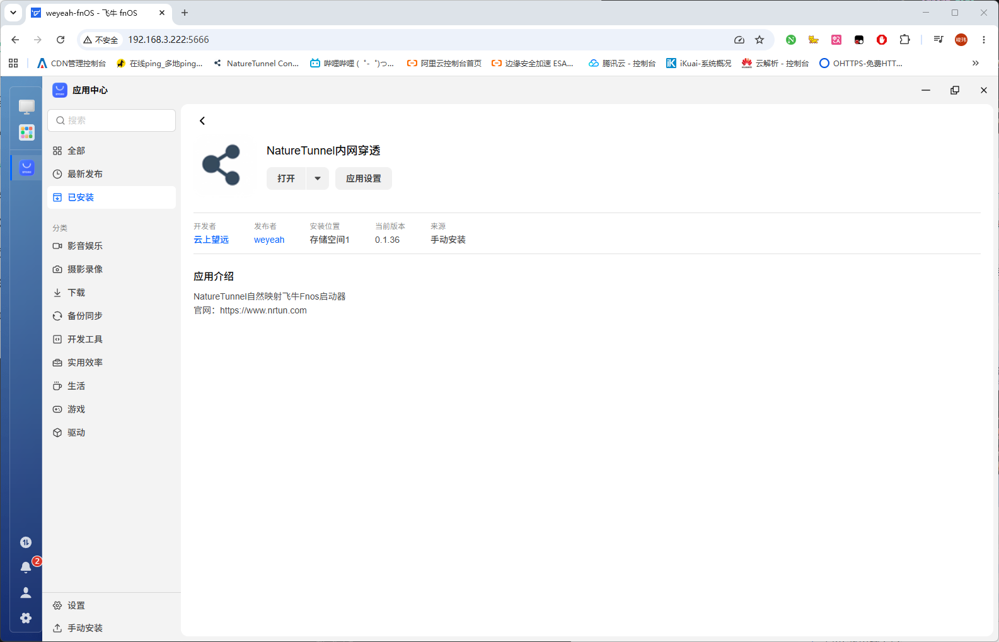
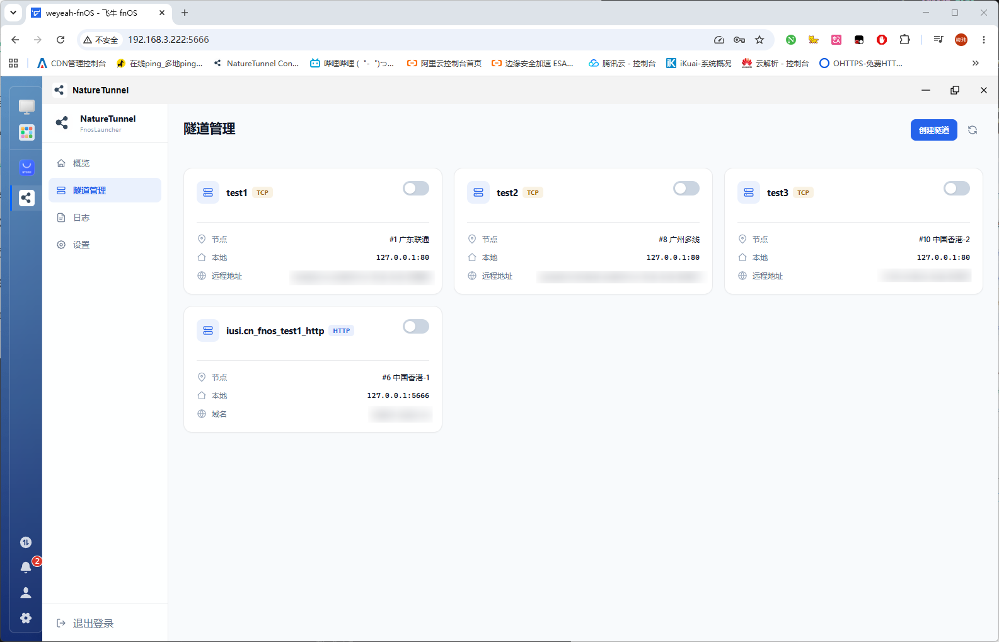
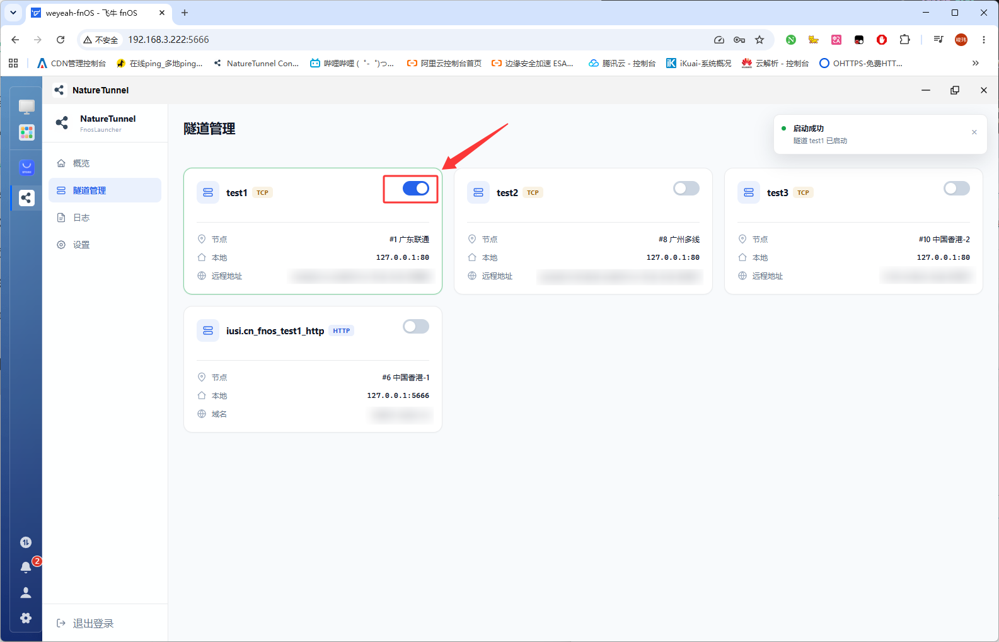
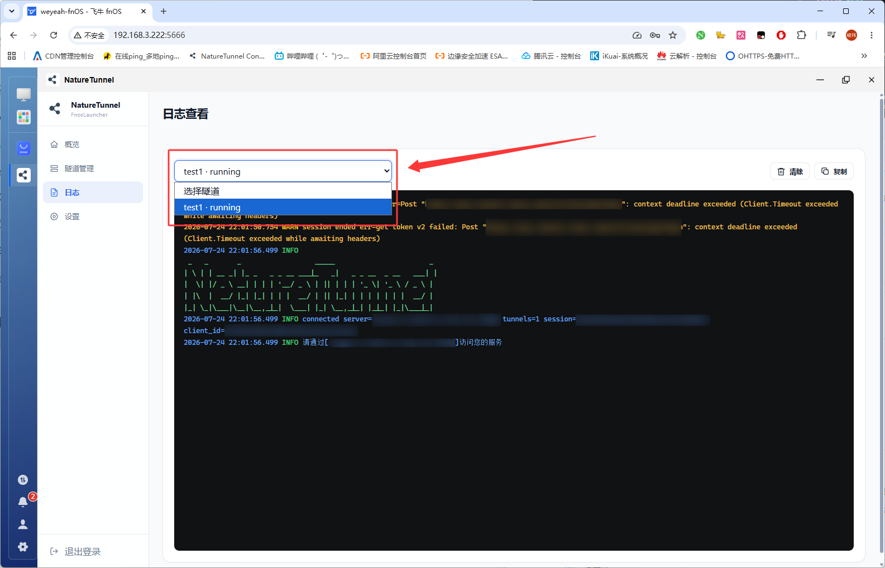

# NatureTunnel 飞牛fnOS图形化客户端操作文档

# 介绍

- 本文档将一步步向您介绍如何在飞牛fnOS平台上使用NatureTunnel 飞牛fnOS图形化客户端启动隧道。

# 操作步骤

## 准备工作

1. 一台已经安装飞牛fnOS的NAS。

2. 在NatureTunnel控制台 [创建隧道](https://console.nrtun.com/tunnel/create) 页面内，按照您本地服务类型创建所需隧道。

3. 在NatureTunnel控制台 [软件下载](https://console.nrtun.com/release) 页面内，下载适用与您系统架构，系统类型为`飞牛fnOS`的`NatureTunnel飞牛fnOS图形化客户端`。完成后您将获得一个后缀为`.fpk`的飞牛fnOS软件中心离线安装包（飞牛软件中心官方上架正在内部测试中，敬请期待）。

## 安装客户端

1. 打开飞牛fnOS桌面。

2. 打开`应用中心`，点击左下角`手动安装`。

3. 点击`从电脑上传`，从电脑选择前面准备工作中得到的`.fpk`文件并上传。

4. 点击`同意`。

5. 按照预期，现在NatureTunnel 飞牛fnOS图形化客户端已经安装完毕，你可以在已安装应用内找到它。

## 客户端基础操作/启动隧道

1. 打开客户端，您将看到形如下图登录界面，请输入您的用户名及密码完成登录。

2. 登录成功，您将进入到`数据概览`页面，您可以在此页面查看公告、基本信息、完成签到等操作。

3. 接下来我们该启动隧道了，在左侧栏点击`隧道管理`，您将进入到`隧道管理`页面。在这里您将看到您先前在NatureTunnel控制台内创建的隧道。

4. 找到您所需的隧道，点击隧道卡片右上角的操作按钮启动隧道。

## 查看日志

- 若您在启动隧道或者使用过程中出现问题，查看日志可以帮助您快速的定位问题并寻求帮助。

1. 在左侧栏点击`日志`，您将进入到`日志查看`页面，您可以在此页面查看已启动隧道的日志。通过选择器选择您所需查看的隧道日志。

2. 如果查看日志仍不能使您解决问题，您需要进行一些求助。首选方案是使用搜索引擎，若仍无法解决您的问题，您需要在控制台内寻找并加入用户交流群，发送您的日志截图友善寻求帮助。注意，在发送日志前请妥善保护您的隐私信息（如：连接地址、连接凭据等信息），您还需要注意的是，群内成员没有义务为您解决问题，请注意您提问的方式和态度，妥善的提问是一种智慧，可以帮助您快速的解决问题。
