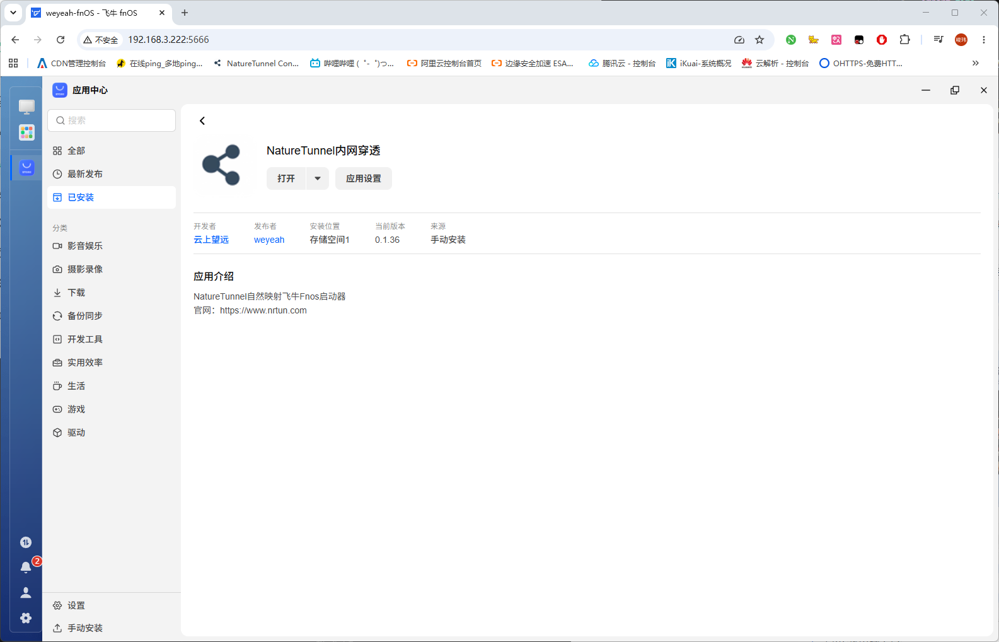
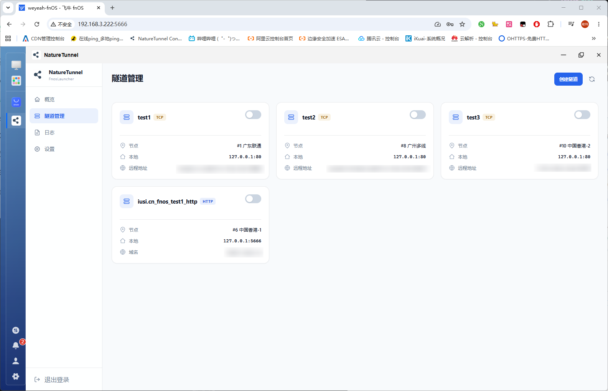
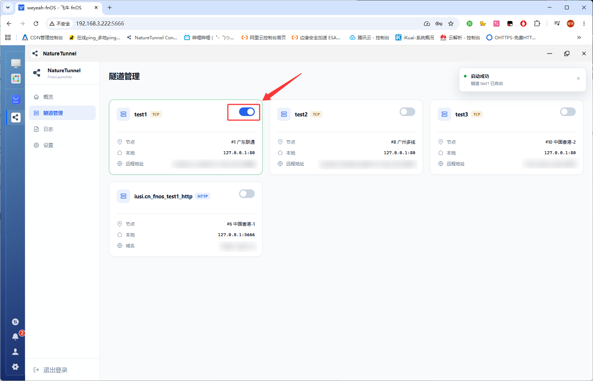
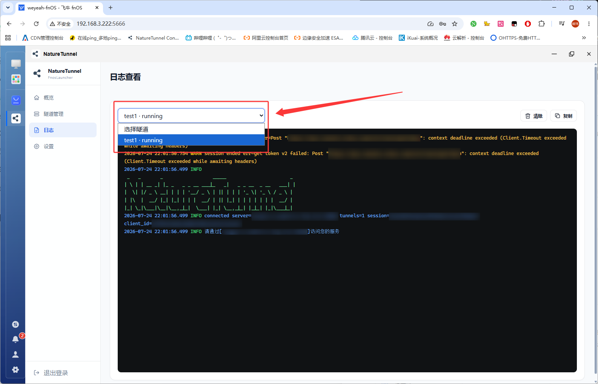

# NatureTunnel 飞牛 fnOS 图形化客户端操作文档

## 介绍

- 本文档将逐步介绍如何在飞牛 fnOS 平台上使用 NatureTunnel 飞牛 fnOS 图形化客户端启动隧道。

## 准备工作

1. 一台已安装飞牛 fnOS 的 NAS 设备。

2. 在 NatureTunnel 控制台的 [创建隧道](https://console.nrtun.com/tunnel/create) 页面，根据您的本地服务类型创建所需隧道。

3. 在 NatureTunnel 控制台的 [软件下载](https://console.nrtun.com/release) 页面，下载适用于您系统架构、系统类型为 `飞牛fnOS` 的 `NatureTunnel 飞牛 fnOS 图形化客户端`。完成后您将获得一个后缀为 `.fpk` 的飞牛 fnOS 软件中心离线安装包。

:::note
飞牛软件中心官方上架正在内部测试中，敬请期待。
:::

## 安装客户端

1. 打开飞牛 fnOS 桌面。

2. 打开 `应用中心`，点击左下角 `手动安装`。

3. 点击 `从电脑上传`，选择准备工作中的 `.fpk` 文件并上传。

4. 点击 `同意`。

5. 安装完成后，您可以在「已安装应用」中找到 NatureTunnel 飞牛 fnOS 图形化客户端。

## 启动隧道

1. 打开客户端，在登录界面输入您的用户名及密码完成登录。

2. 登录成功后进入 `数据概览` 页面，您可以在此查看公告、基本信息，并完成签到等操作。

3. 点击左侧栏 `隧道管理`，进入 `隧道管理` 页面，这里会显示您在 NatureTunnel 控制台创建的隧道。

4. 找到目标隧道，点击隧道卡片右上角的操作按钮启动隧道。

## 查看日志

如果启动隧道或使用过程中出现问题，查看日志可以帮助您快速定位问题并寻求支持。

1. 点击左侧栏 `日志`，进入 `日志查看` 页面，通过选择器选择需要查看的隧道日志。

2. 如果查看日志仍无法解决问题，可以按照以下方式寻求帮助：

    1. 优先使用搜索引擎检索相关问题。
    2. 若仍无法解决，请在控制台内寻找并加入用户交流群，发送日志截图并友善地寻求帮助。

:::warning
发送日志前请妥善保护隐私信息（如连接地址、连接凭据等）。群内成员没有义务为您解决问题，请注意提问的方式与态度，友善清晰的提问更容易获得帮助。
:::
